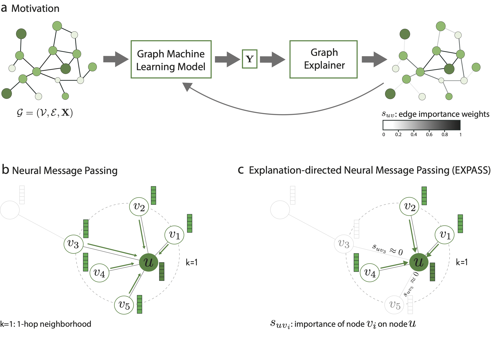

## Towards Training GNNs using Explanation Directed Message Passing

This repository contains source code necessary to reproduce some of the main results in [the paper](https://arxiv.org/abs/2211.16731):

**If you use this software, please consider citing:**
    
      @inproceedings{giunchiglia2022towards,
        title={Towards Training {GNN}s using Explanation Directed Message Passing},
        author={Valentina Giunchiglia and Chirag Varun Shukla and Guadalupe Gonzalez and Chirag Agarwal},
        booktitle={The First Learning on Graphs Conference},
        year={2022},
        url={https://openreview.net/forum?id=_nlbNbawXDi}
        }  

<p align="center">
    
</p>
<p align="center"><i>
  a) EXPASS investigates the problem of injecting explanations into the message-passing framework to increase the expressive power and performance of GNNs. b) Shown is the general message passing scheme where, for node u, messages are aggregated from nodes vi ∈ Nu in the 1-hop neighborhood of u. c) EXPASS injects explanations into the message passing framework translates by masking out messages from neighboring nodes vi ∈ Nu with explanation scores suvi ≈ 0 when u is correctly classified
</i></p>

## 1. Setup

### Installing software
The packages used and their versions are available in the environmemt.yml file. This repository is built using PyTorch. You can install the necessary libraries by following these commnads: 

1. Create a conda environment with python=3.9
      `conda create -n logml2 python=3.9`
2. Install torch_geometric from the python wheels following the instructions [here](https://pytorch-geometric.readthedocs.io/en/2.0.4/notes/installation.html)

   a. Find the torch version `python -c "import torch; print(torch.__version__)"` and save the output as bash variable TORCH

   b. Find the cuda version `python -c "import torch; print(torch.version.cuda)"` and save the output as bash variable CUDA

   c. Run `python -m pip install torch-scatter -f https://data.pyg.org/whl/torch-${TORCH}+${CUDA}.html`.  The `python -m pip` is important. It may take a while to install.

   d. Run `python -m pip install torch-sparse -f https://data.pyg.org/whl/torch-${TORCH}+${CUDA}.html`
3. Run `python -m pip install torch-geometric==2.0.4`
4. Install missing pypi dependencies with `python -m pip install pgmpy matplotlib ipdb pandas`
5. Install `graphxai` following the instructions [here](https://github.com/mims-harvard/GraphXAI).

## 2. Datasets
We run thee experiments on 4 real-world datasets (DD, Proteins, Mutag and Alkane). To choose the dataset, you have to change the `--dataset` argument.

## 3. Usage
To run all combinations of architectures and datasets, both for vanilla and EXPASS, you can run the bash script `run.sh` as follows:

      bash run.sh

To run the vanilla version of the scripts with the deafult parametrs, you can use:

```
   python train.py \
      --dataset <DATASET> \
      --arch <ARCHITECTURE> \
      --vanilla_mode
```
To run the EXPASS version of the scripts with the default parameters, you can use:


```
python train.py \
   --dataset <DATASET>  \
   --arch <ARCHITECTURE> \
   --explainer <EXPLAINER>
```
## 4. License
Note that the code in this repository is licensed under MIT License. Please carefully check them before use.

## 5. Questions?
If you have questions/suggestions, please feel free to email one of the authors ([Valentina Giunchiglia](v.giunchiglia20@imperial.ac.uk), or [Chirag Shukla](shukla@math.lmu.de)) or create github issues.

